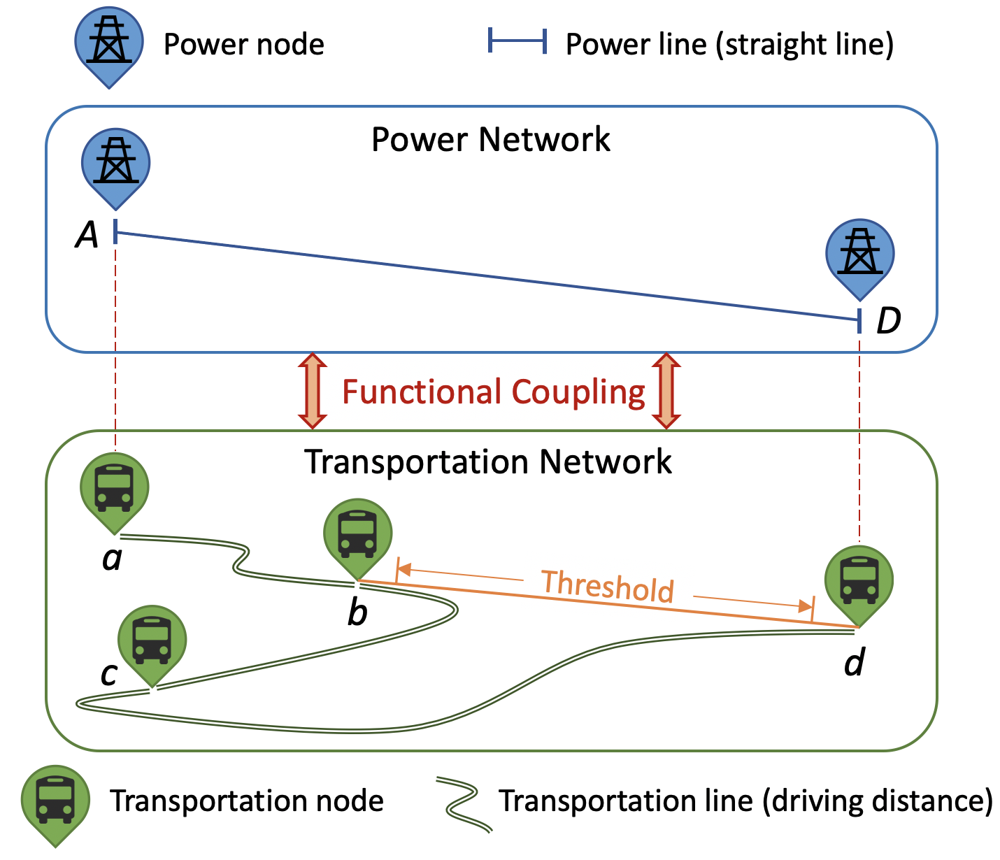

<h2 align='center'>
    GTFS_PowerTransNet
</h2>

<h4 align='center'>
GTFS_PowerTransNet: A Python Function to Generate a Coupled Power and Transportation Network for Planning Purposes
</h4>

[](https://ise.washington.edu/)
[](https://tomnet-utc.engineering.asu.edu/projects/uw-fast-charging/)

<p align="center">
 
    <br>
    <em>Fig. 1 Functional interconnection of nodes in the coupled power and transportation network.</em>
</p>


## :star: Features

**GTFS_PowerTransNet** is a specialized tool designed for electric bus planners, offering several key features:

-  :round_pushpin: Abstracting the transportation network from the intricate bus route map based on transit agency's General Transit Feed Specification (GTFS) data.
    - Identifying potential sites for charging stations by selecting bus stations along the routes;
    - Capable of handling both one-directional and two-directional bus routes within GTFS files;
    - Visualizing the transportation map and saving the resulting transportation network as geojson files for future GIS analysis.
- :bulb: Constructing a virtual power network that aligns geographically with the chosen bus stations.
  - Further selection of power nodes from the transportation nodes, ensuring an appropriate geographical distance between them; 
  - Utilization of the minimum spanning tree (MST) algorithm to establish branches connecting the chosen power nodes.
- :moneybag: Facilitating the optimization of electric bus facility deployment through the integration of a coupled power and transportation network.


## :bus: Transportation Network

>We have established a set of guidelines for selecting nodes from the available bus stations, taking practical considerations into account:
>
>1. When selecting nodes, priority is assigned to common bus stops that are connected to multiple bus routes, as they have a greater impact on the transportation network.
>2. For each bus route, the origin station and terminal station are identified as nodes in the transportation network.
>3. A distance threshold is set starting from the origin station. During the node selection process, we assess the distance between the current bus station and the previously selected node. If this distance exceeds the threshold, we incorporate the station preceding the current bus station as a new node within the transportation network.
>4. The service loop of a bus is also taken into account. Bus stations located on opposite sides of the street are considered separate nodes if both are selected.


- To accomplish this functionality, **GTFS_PowerTransNet** utilizes the **BEB_bus_network** function, which requires the following inputs: GTFS file, BEB route string list, traveling threshold, and minimum number of routes.
- Upon successful execution, the function will provide the following outputs:
  1. A dataframe that records the selected transportation nodes, including stop_id, stop_lon, and stop_lat.
  2. A dataframe that records the line segments forming the links in the transportation network.
  3. A Kepler map showcasing the generated transportation network. 
  4. The function will save the aforementioned dataframes as two geojson files in the current folder. Similarly, the map will be saved in the same folder for easy access and reference.
- Let's take the GTFS files of King County, WA as an example:

```bash
WA_candidate_stops_df, WA_shape_routes_df, WA_map_1 = BEB_bus_network(WA_gtfs_file, WA_BEB_route, dist_threshold, common_stop_threshold)
```


##  :electric_plug: Power Network

>The distance between two adjacent bus stations is usually much shorter than the distance between two power grid nodes in reality. Therefore, we need to further refine the selection of power grid nodes from the transportation nodes. For clustered bus stations, we connect them to a single node in the virtual power network.

<p align="center">
 
    <br>
    <em>Fig. 2 Illustration of node selection rules for constructing the virtual power network.</em>
</p>


- To accomplish this functionality, **GTFS_PowerTransNet** utilizes the **virtual_power_network** function, which requires the following inputs: a dataframe containing the selected transportation nodes and a distance threshold.
- Upon successful execution, the function will provide the following outputs:
  1. A dataframe that documents the chosen power nodes.
  2. A dataframe that captures the connections within the power network.
  3. A Kepler map displaying the created virtual power network.
  4. The power network will be graphically represented and plotted. Additionally, the map will be saved in the current folder for future reference.
- Let's take the generated power network of King County, WA as an example:

```bash
WA_selected_power_nodes, WA_power_line_list, WA_map_2 = virtual_power_network(WA_candidate_stops_df, threshold_power_node)
```


##  :anchor: Coupled Network

>The two functions mentioned above, **BEB_bus_network** and **virtual_power_network**, can be utilized independently to generate the transportation network and the virtual power network, respectively. Alternatively, they can be sequentially called within the **GTFS_PowerTransNet** function to visualize the coupled network. By overlapping these two networks onto a single map, we can obtain a holistic perspective of the coupled network in electric bus planning projects.


- Let's consider the generated coupled network of King County, WA as an example, if you execute the following code:

```bash
WA_coupled_map = GTFS_TransPowerNet(WA_gtfs_file, WA_BEB_route, dist_threshold, common_stop_threshold, threshold_power_node)
WA_coupled_map
```

- It will generate the map displayed below:

<p align="center">
 
    <br>
    <em>Fig. 3 Coupled power and transportation network of King County.</em>
</p>


</div>


## :smiley: Citing 

If you use **GTFS_PowerTransNet** in a scientific publication, we would appreciate citations to:

```bibtex
@article{zhao2023grid-aware,
  title={Grid-Aware On-Route Fast-Charging Infrastructure Planning for Battery Electric Bus with Equity Considerations: A Case Study in South King County},
  author={Zhao, Xinyi and Zhao, Chaoyue and Jia, Grace},
  journal={arXiv preprint arXiv:2309.07422},
  year={2023},
}
```


