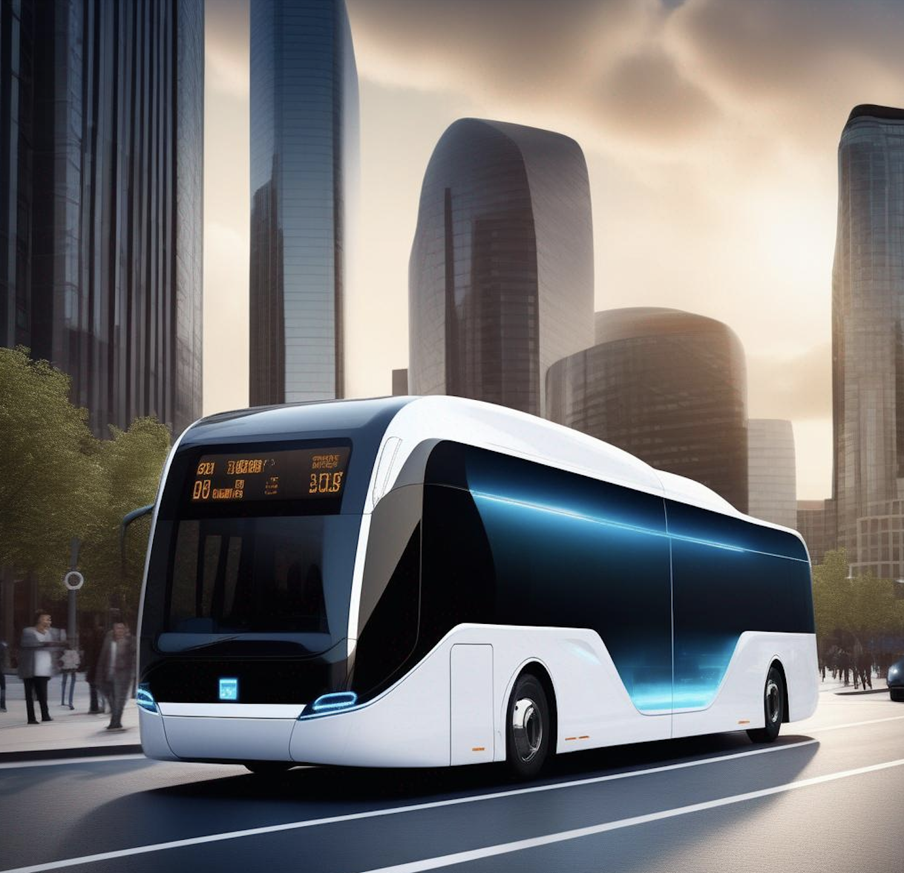

<h2 align='center'>
    Electric Buses: Navigating Towards Cleaner, Advanced Transportation and Power Systems!
</h2>

Hello, young explorers and future scientists! Today, we're going on an exciting journey into the world of electric buses, where we'll discover how transportation and power systems come together to create a cleaner future :oncoming_bus::zap::earth_americas:.

 
     
    <em>Fig. 1 Future in Motion: Electric Buses and Eco-Friendly Charging in a Sustainable Cityscape.</em>

## :bus: Why Electric Buses?
Did you know that traditional buses contribute to air pollution? That's why electric buses are super important. They're like silent heroes, gliding through the streets without creating smoke or loud noises. But how do they do this? They use electricity instead of diesel, which is way better for our planet :earth_americas:!

## :oncoming_bus: How Do Electric Buses Work?
Imagine a big battery-powered toy car. Now, make it much bigger – that's an electric bus for you! These buses have large batteries that store electricity, which powers the bus instead of using diesel. Just like you charge your phone, these buses get charged too!

## :bulb: Why Is This Research Important?
Think about the air you breathe. We want it to be clean and fresh, right? By researching electric buses, we can learn how to make more buses that don't pollute the air. This means cleaner air for you, me, and all the animals and plants!

## :star: The Interdisciplinary Adventure

Now, here's where our adventure gets even more interesting. To plan for electric buses, we need to think about two big things: transportation (how the buses will move around the city) and power systems (how we'll keep the buses charged and ready to go). It's like a puzzle where both pieces need to fit perfectly!

-  **Transportation System Angle:**
  - We'll explore routes, bus stops, and how to make sure buses are where people need them when they need them. It's like designing a super-efficient bus dance across the city!

-  **Power System Angle:**
  - Here, we'll dive into how to keep our electric buses charged. Do we need big batteries? Where should charging stations be? How do we make sure there's always enough power? It's a bit like planning a giant, city-wide game of tag, where charging stations are the 'safe zones'.

## :wrench: Your Exploration Tool: GTFS_PowerTransNet
To help you understand and explore this cool world of electric bus planning, there's a nifty tool called **GTFS_PowerTransNet**. It's a Python function (a piece of computer code) that helps create a combined map of power and transportation networks. It's like having a digital sandbox where you can play and see how transportation and power systems work together for electric buses.

## :smiley: Conclusion:
So, let's power up our imagination and dive into the amazing world of electric buses. With tools like **GTFS_PowerTransNet** and a little bit of curiosity, you can be part of planning a cleaner, greener future. Stay curious and keep exploring!

